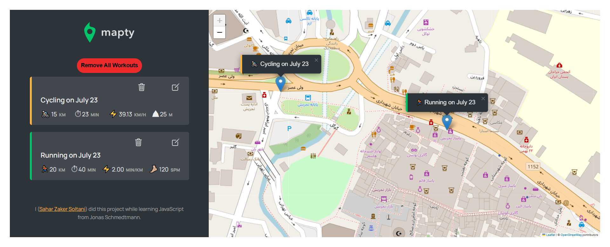

# Mapty App

A simple map-based workout tracker built using JavaScript and Leaflet.js. It allows users to log running and cycling workouts, view them on a map, and see workout details such as distance, duration, and more.

---

⚠️ **Important for users in Iran:**  
Due to possible restrictions on map services (e.g. Leaflet/OpenStreetMap), **you may need to use a VPN** to access and use this app properly.

---

## Screenshot

  

---

## Technologies Used

This project was built using:

-  **JavaScript (ES6+)** — with **Object-Oriented Programming (OOP)**
-  **Geolocation API** — to get user's current location
-  **Leaflet.js** — external library for interactive maps
-  **LocalStorage API** — for saving data locally in the browser
-  **HTML & CSS** — for structure and styling

---

##  Features

- Locate user’s current location on the map
- Add workouts (running or cycling) by clicking on the map
- Display workout details in a list
- Zoom to workout location on click
- Automatically saves workouts in localStorage
- Fully responsive design

---

## How to Use

1. Open the app and allow location access.
2. Click on the map to add a new workout.
3. Fill in the form (distance, duration, etc.).
4. See your workouts listed and displayed on the map.
5. Refresh the page — data remains saved.

